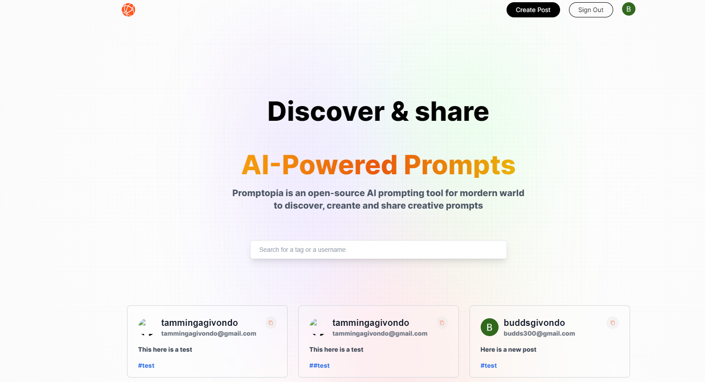

## <a name="introduction">🤖 Introduction</a>



Developed is a Next.js application that highlights the key features of Next.js along with a comprehensive CRUD AI Prompt sharing system utilizing a MongoDB database and implementing NextAuth authentication.

If you're getting started and need assistance or face any bugs, join our active Discord community with over 27k+ members. It's a place where people help each other out.


# <a name="tech-stack">⚙️ Tech Stack</a>

- Next.js
- MongoDB
- NextAuth
- TailwindCSS

## <a name="features">🔋 Features</a>

👉 **Modern Design with Glassmorphism Trend Style**: A modern and visually appealing design, incorporating the glassmorphism trend style for a sleek and contemporary appearance.

👉 **Discover and Share AI Prompts**: Allow users to discover AI prompts shared by the community and create their own prompts to share with the world.

👉 **Edit and Delete Created Prompts**: Users have the ability to edit their created prompts at any time and delete them when needed.

👉 **Profile Page**: Each user gets a dedicated profile page showcasing all the prompts they've created, providing an overview of their contributions.

👉 **View Other People's Profiles**: Users can explore the profiles of other creators to view the prompts they've shared, fostering a sense of community.

👉 **Copy to Clipboard**: Implement a convenient "Copy to Clipboard" functionality for users to easily copy the AI prompts for their use.

👉 **Search Prompts by Specific Tag**: Allow users to search for prompts based on specific tags, making it easier to find prompts related to specific topics.

👉 **Google Authentication using NextAuth**: Enable secure Google authentication using NextAuth, ensuring a streamlined and trustworthy login experience.

👉 **Responsive Website**: Develop a fully responsive website to ensure optimal user experience across various devices, from desktops to smartphones

and many more, including code architecture and reusability 

## <a name="quick-start">🤸 Quick Start</a>

Follow these steps to set up the project locally on your machine.

**Prerequisites**

Make sure you have the following installed on your machine:

- [Git](https://git-scm.com/)
- [Node.js](https://nodejs.org/en)
- [npm](https://www.npmjs.com/) (Node Package Manager)

**Cloning the Repository**

```bash
git clone https://github.com/adrianhajdin/project_next_13_ai_prompt_sharing.git
cd project_next_13_ai_prompt_sharing
```

**Installation**

Install the project dependencies using npm:

```bash
npm install
```

**Set Up Environment Variables**

Create a new file named `.env` in the root of your project and add the following content:

```env
NEXTAUTH_URL=http://localhost:3000
NEXTAUTH_URL_INTERNAL=http://localhost:3000
NEXTAUTH_SECRET=
GOOGLE_ID=
GOOGLE_CLIENT_SECRET=
MONGODB_URI=
```

Replace the placeholder values with your actual credentials. You can obtain these credentials by signing up on these corresponding websites from [Google Cloud Console](https://console.cloud.google.com/welcome?rapt=AEjHL4MBaLLneW6OfAHf_zgms1eWZFw1wdy0_KIC4uh1nEqh2m4ojOvrXNlzJ4h7CZTkpiWgcsoHbUvS-FMdCP7WIkaVlPAeU7cnVR6Y0wJHeLMOtU6KAzA&project=promptopia-385410), [Cryptpool](https://www.cryptool.org/en/cto/openssl) (for random Auth Secret), and [MongoDB](https://www.mongodb.com/). 

**Running the Project**

```bash
npm run dev
```

Open [http://localhost:3000](http://localhost:3000) in your browser to view the project.

## <a name="snippets">🕸️ Snippets</a>

<details>
<summary><code>globals.css</code></summary>

```css
@import url("https://fonts.googleapis.com/css2?family=Inter:wght@100;200;300;400;500;600;700;800;900&display=swap");

@tailwind base;
@tailwind components;
@tailwind utilities;

/* 
  Note: The styles for this gradient grid background is heavily inspired by the creator of this amazing site (https://dub.sh) – all credits go to them! 
*/

## Learn More

To learn more about Next.js, take a look at the following resources:

- [Next.js Documentation](https://nextjs.org/docs) - learn about Next.js features and API.
- [Learn Next.js](https://nextjs.org/learn) - an interactive Next.js tutorial.

You can check out [the Next.js GitHub repository](https://github.com/vercel/next.js/) - your feedback and contributions are welcome!

## Deploy on Vercel

The easiest way to deploy your Next.js app is to use the [Vercel Platform](https://vercel.com/new?utm_medium=default-template&filter=next.js&utm_source=create-next-app&utm_campaign=create-next-app-readme) from the creators of Next.js.

Check out our [Next.js deployment documentation](https://nextjs.org/docs/deployment) for more details.
